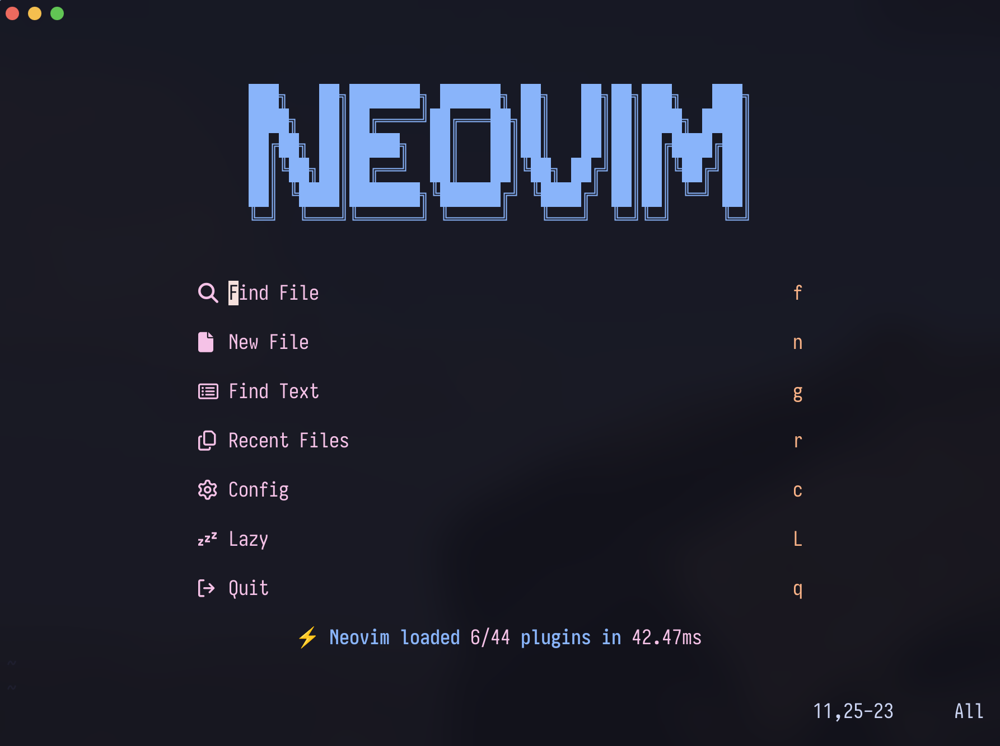

# My Dotfiles




Everything is managed via gnu `stow`. The tl;dr is that relative to the dotfiles
directory (that you should clone to `~/.dotfiles` it will symlink the directory
you name up one directory. Different python, node, terraform versions are all
managed with [mise](https://github.com/jdxcode/mise)

For example, zsh/ contains `.zshrc` so to deploy your
zsh folder using `stow` you simply run

```bash
stow zsh
```

and for neovim

```bash
stow nvim
```

Creates the symlinks all the way to `~/.config/nvim/*`

## Essential Software

This is a list of software I use all the time and wouldn't be as productive
without it, feel free to pick and choose what you like.

### Install via Brew

```bash
brew install \
    age \
    argon2 \
    bat \
    bottom \
    colima \
    docker \
    docker-compose \
    docker-buildx \
    docker-credential-helper \
    duckdb \
    entr \
    eza \
    fd \
    fzf \
    ghostty \
    git-delta \
    hurl \
    jq \
    jj \
    lazydocker \
    lazygit \
    mise \
    neovim \
    nnn \
    pandoc \
    restic \
    ripgrep \
    sops \
    stow \
    uv \
    zoxide

brew install --cask ghostty
```

# Descriptions

- **age**: Simple, modern, secure file encryption
- **argon2**: Password hashing library and CLI utility
- **bat**: Clone of cat(1) with syntax highlighting and Git integration
- **bottom**: Yet another cross-platform graphical process/system monitor
- **colima**: Docker cli free OSS
- **docker**: Docker and it's related plugins/extensions
- **duckdb**: Embeddable SQL OLAP Database Management System
- **entr**: Run arbitrary commands when files change
- **eza**: Modern, maintained replacement for ls
- **fd**: Simple, fast and user-friendly alternative to find
- **fzf**: Command-line fuzzy finder written in Go
- **hurl**: HTTP Tool
- **ghostty**: Current terminal emulator
- **git-delta**: Syntax-highlighting pager for git and diff output
- **jq**: Lightweight and flexible command-line JSON processor
- **jj**: VCS alternative to git but also git compatible (Jujutsu)
- **lazydocker**: Simple terminal UI for docker commands
- **lazygit**: Simple terminal UI for git commands
- **mise**: Polyglot runtime manager (asdf rust clone)
- **neovim**: Ambitious Vim-fork focused on extensibility and agility
- **nnn**: Minimal terminal file manager
- **pandoc**: Swiss-army knife of markup format conversion
- **restic**: Back-up utility with snapshots and backups
- **ripgrep**: Search tool like grep and The Silver Searcher
- **sops**: Editor of encrypted files
- **stow**: Organize software neatly under a single directory tree (e.g. /usr/local)
- **stylua**: Opinionated Lua code formatter
- **uv**: Extremely fast Python package installer and resolver, written in Rust
- **zoxide**: Shell extension to navigate your filesystem faster

## Different Modules

### [Backups](./backups)

- Online via Restic + Backblaze
- Offline via Rsync + Age

### [Fonts](./fonts/.local/share/fonts)

- Nerd Font Patched version of [Iosevka](https://typeof.net/Iosevka/)'s private
  build plans are in the font directory, but the latest version I build, I just
  upload [here](https://drive.google.com/drive/folders/1UbV9Lk9jbUynyOmudZMBwd3Fygve76P2)

### FZF

Auto complete for the shell settings for fzf

### [Neovim](./nvim/.config/nvim)

My Neovim config with all plugins and settings

### [Starship](./starship/.config/starship/starship.toml)

Simple tweaks for the [starship.rs](https://starship.rs/) theme for zsh

### Mise

Using Mise can be done seeing `mise --help`

To set your project to automatically activate a virtualenv when switching to it
create a `.mise.toml` in your project directory and add.

```toml
python = {version="latest", virtualenv=".venv"}
```

### [Ghostty 👻](./ghostty/.config/ghostty)

Wezterm terminal

## Questions

If you have any questions send me a message at [Mastodon]("https://fosstodon.org/@mdawg")
