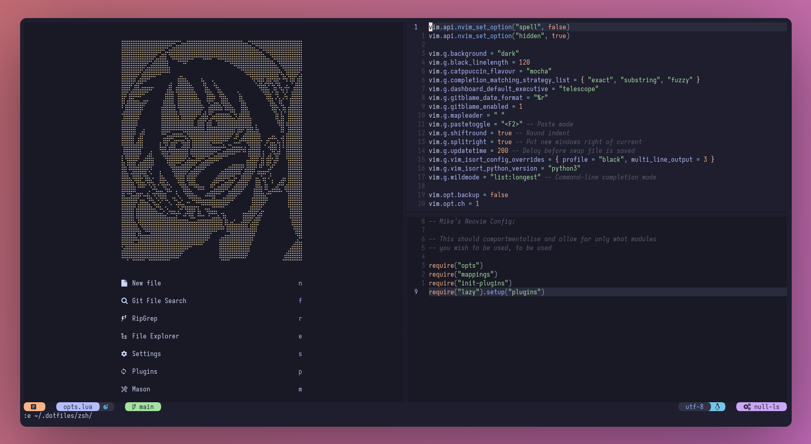

# My NVIM config

Config files for neovim
You need to be on nvim >= 0.8.2

You can grab the most recent nightly release (until not necessary) from here:
[Neovim Releases](https://github.com/neovim/neovim/releases)

#### Dependencies

- [Lazy](https://gitlab.com/of_jorts/dotfiles/-/tree/main/nvim/.config/nvim) (Should install when you open neovim)
  (Then run `:Lazy` to update/install.) There will also be a dashboard option in alpha under the prefix `p`

#### Third Party Tools

A list of tools that are in my config either for linting formatting or navigation.
To get the full experience you will want to install

- `fzf`
- `nnn`
- `lazygit`

The rest of the tools used in neovim are installed via `:Mason` and can be
accessed from the dashboard as well `m`
